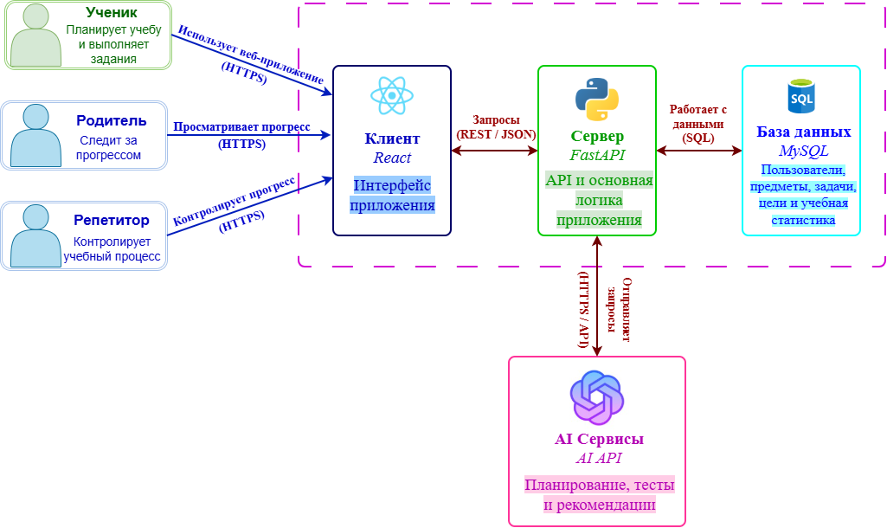
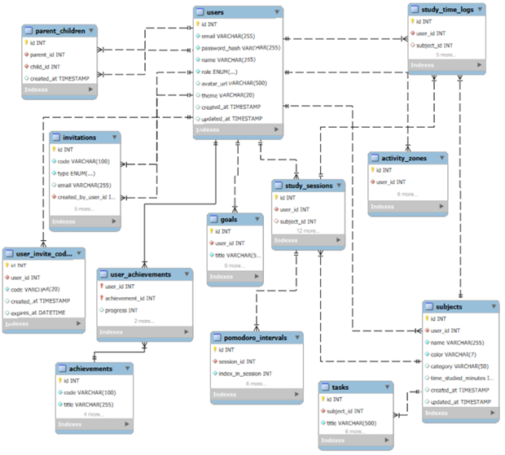

# Архитектура серверного приложения Studly

## 1. Use Cases

### Назначение системы

Studly — веб-приложение для организации учебного процесса. Система позволяет пользователю планировать обучение, управлять предметами и задачами, устанавливать учебные цели, проводить учебные сессии с использованием техники Pomodoro, отслеживать затраченное время и анализировать собственную продуктивность.

Для выполнения задания рассмотрены две основные роли: **студент** и **родитель**.

### Роль «Студент»

| | |
|---|---|
| **Актор** | Студент |
| **Основные действия** | Регистрация и авторизация; управление предметами, задачами и целями; планирование и проведение учебных сессий (Pomodoro); учёт времени; просмотр статистики и достижений; использование AI-планирования и AI Study Companion |

**Сценарии использования:**

| Use Case | Описание |
|---|---|
| Регистрация | Создание учётной записи в системе |
| Авторизация | Вход в систему с использованием учётных данных |
| Управление предметами | Добавление, изменение и удаление учебных предметов |
| Управление задачами | Создание, изменение, выполнение и удаление учебных задач |
| Управление целями | Создание целей и отслеживание их выполнения |
| Планирование сессии | Создание и планирование учебной сессии |
| Pomodoro | Проведение учебной сессии с рабочими интервалами и перерывами |
| Учёт времени | Сохранение количества времени, затраченного на обучение |
| Просмотр статистики | Анализ учебного времени и активности |
| Достижения | Получение и просмотр достижений |
| AI-планирование | Получение персонализированного учебного плана |
| AI Study Companion | Получение помощи при изучении учебного материала |

### Роль «Родитель/Репетитор»

| | |
|---|---|
| **Актор** | Родитель/Репетитор |
| **Основные действия** | Регистрация и авторизация; приглашение и связывание аккаунта учащегося; просмотр предметов, задач, целей, учебного времени и статистики учащегося |

**Сценарии использования:**

| Use Case | Описание |
|---|---|
| Регистрация | Создание учётной записи родителя |
| Авторизация | Вход в систему |
| Приглашение учащегося | Создание приглашения для связи аккаунтов |
| Связь с учащимся | Привязка аккаунта учащегося к аккаунту родителя |
| Просмотр предметов | Просмотр учебных предметов учащегося |
| Просмотр задач | Контроль выполнения учебных задач |
| Просмотр целей | Контроль поставленных учащимся целей |
| Просмотр учебного времени | Анализ времени, затраченного на обучение |
| Просмотр статистики | Контроль общего учебного прогресса |

Связь между родителем и учащимся реализована через таблицу `parent_children`, в которой хранятся идентификаторы связанных пользователей. В БД также предусмотрена таблица `invitations` для создания и обработки приглашений.

### Диаграмма Use Case

Исходник: [use-cases.puml](use-cases.puml)

---

## 2. Ключевые сущности

В базе данных Studly выделены следующие основные сущности:

| Сущность | Таблица | Назначение | Основные данные |
|---|---|---|---|
| Пользователь | `users` | Хранение пользователей и их ролей | id, email, password_hash, name, role, avatar_url, theme, created_at, updated_at |
| Предмет | `subjects` | Учебные предметы пользователя | id, user_id, name, color, category, time_studied_minutes, created_at, updated_at |
| Задача | `tasks` | Учебные задачи | id, subject_id, title, description, priority, is_completed, due_date, created_at, updated_at |
| Цель | `goals` | Учебные цели | id, user_id, title, type, target_value, current_value, color, is_completed, period_start, period_end |
| Учебная сессия | `study_sessions` | Запланированные и выполненные учебные сессии | id, user_id, subject_id, goal, work_interval, short_break, long_break, intervals_count, duration_minutes, status, scheduled_at, started_at, completed_at |
| Pomodoro-интервал | `pomodoro_intervals` | Рабочие интервалы и перерывы | id, session_id, index_in_session, type, planned_minutes, actual_minutes, started_at, finished_at |
| Учебное время | `study_time_logs` | Учёт затраченного времени | id, user_id, subject_id, session_id, date, minutes_studied, tasks_completed |
| Зона активности | `activity_zones` | Анализ продуктивности по времени | id, user_id, time_slot, time_start, time_end, score, date |
| Достижение | `achievements` | Справочник достижений | id, code, title, description, icon_name, color |
| Достижение пользователя | `user_achievements` | Связь пользователей с достижениями | user_id, achievement_id |
| Родитель–учащийся | `parent_children` | Связь между аккаунтами | идентификаторы связанных пользователей |
| Приглашение | `invitations` | Приглашения для связывания аккаунтов | ссылки на пользователя, создавшего приглашение, и целевого пользователя |
| Код приглашения | `user_invite_codes` | Персональные коды приглашений | персональные коды приглашений пользователей |

---

## 3. C4 Container Diagram

Система Studly построена по **клиент-серверной архитектуре**.

### Основные контейнеры

| Контейнер | Технология | Назначение |
|---|---|---|
| **Client** | React | Веб-клиент. Пользователь работает с системой через веб-клиент React. Клиент отправляет запросы серверу FastAPI через REST API. Не обращается к базе данных или AI-сервису напрямую. |
| **Backend Service** | FastAPI | Серверное приложение. Выполняет основную бизнес-логику приложения: проверяет права доступа, обрабатывает данные пользователей, предметов, задач, целей и учебных сессий. |
| **Database** | MySQL | Хранение постоянных данных. Сервер взаимодействует с базой данных для чтения и записи данных. |
| **AI Service** | Внешний AI API | Внешний сервис искусственного интеллекта. AI-функции (AI-планирование, AI Study Companion) вызываются сервером через внешний AI API. |

### Взаимодействие

- Пользователь работает с системой через веб-клиент React.
- Клиент отправляет запросы серверу FastAPI через REST API.
- Backend Service выполняет основную бизнес-логику приложения.
- Для хранения постоянных данных сервер взаимодействует с базой данных MySQL.
- AI-функции вызываются сервером через внешний AI API.
- Клиент не обращается к базе данных или AI-сервису напрямую.

### Диаграмма

*Рис. 1. C4-диаграмма для веб-приложения «Studly»*

Исходник PlantUML: [c4-container.puml](c4-container.puml)

---

## 4. ER-диаграмма

### Таблица `users`

Таблица `users` является центральной сущностью системы. В ней также определены роли `student`, `parent`, `teacher` и `admin`.

| Поле | Тип | Назначение |
|---|---|---|
| id | INT | PK |
| email | VARCHAR(255) | Электронная почта, **UNIQUE** |
| password_hash | VARCHAR(255) | Хеш пароля |
| name | VARCHAR(255) | Имя пользователя |
| role | ENUM | Роль пользователя |
| avatar_url | VARCHAR(500) | Аватар |
| theme | VARCHAR(20) | Тема интерфейса |
| created_at | TIMESTAMP | Дата создания |
| updated_at | TIMESTAMP | Дата изменения |

### Таблица `subjects`

| Поле | Тип | Назначение |
|---|---|---|
| id | INT | PK |
| user_id | INT | FK → users.id |
| name | VARCHAR(255) | Название предмета |
| color | VARCHAR(7) | Цвет |
| category | VARCHAR(50) | Категория |
| time_studied_minutes | INT | Учебное время |
| created_at | TIMESTAMP | Дата создания |
| updated_at | TIMESTAMP | Дата изменения |

### Таблица `tasks`

| Поле | Тип | Назначение |
|---|---|---|
| id | INT | PK |
| subject_id | INT | FK → subjects.id |
| title | VARCHAR(500) | Название задачи |
| description | TEXT | Описание |
| priority | ENUM | Приоритет |
| is_completed | BOOLEAN | Статус выполнения |
| due_date | DATETIME | Срок выполнения |
| created_at | TIMESTAMP | Дата создания |
| updated_at | TIMESTAMP | Дата изменения |

### Таблица `goals`

| Поле | Тип | Назначение |
|---|---|---|
| id | INT | PK |
| user_id | INT | FK → users.id |
| title | VARCHAR(500) | Название цели |
| type | ENUM | Тип цели |
| target_value | INT | Плановое значение |
| current_value | INT | Текущее значение |
| color | VARCHAR(7) | Цвет |
| is_completed | BOOLEAN | Статус выполнения |
| period_start | DATE | Начало периода |
| period_end | DATE | Конец периода |

### Таблица `study_sessions`

| Поле | Тип | Назначение |
|---|---|---|
| id | INT | PK |
| user_id | INT | FK → users.id |
| subject_id | INT | FK → subjects.id |
| goal | VARCHAR(500) | Цель сессии |
| work_interval | INT | Рабочий интервал |
| short_break | INT | Короткий перерыв |
| long_break | INT | Длинный перерыв |
| intervals_count | INT | Количество интервалов |
| duration_minutes | INT | Продолжительность |
| status | ENUM | Состояние сессии |
| scheduled_at | DATETIME | Планируемое время |
| started_at | DATETIME | Начало |
| completed_at | DATETIME | Завершение |

### Таблица `pomodoro_intervals`

| Поле | Тип | Назначение |
|---|---|---|
| id | INT | PK |
| session_id | INT | FK → study_sessions.id |
| index_in_session | INT | Номер интервала |
| type | ENUM | Тип интервала |
| planned_minutes | INT | Плановая длительность |
| actual_minutes | INT | Фактическая длительность |
| started_at | DATETIME | Начало |
| finished_at | DATETIME | Завершение |

### Таблица `study_time_logs`

| Поле | Тип | Назначение |
|---|---|---|
| id | INT | PK |
| user_id | INT | FK → users.id |
| subject_id | INT | FK → subjects.id |
| session_id | INT | FK → study_sessions.id |
| date | DATE | Дата |
| minutes_studied | INT | Количество минут |
| tasks_completed | INT | Количество выполненных задач |

### Таблица `activity_zones`

| Поле | Тип | Назначение |
|---|---|---|
| id | INT | PK |
| user_id | INT | FK → users.id |
| time_slot | VARCHAR(20) | Временной интервал |
| time_start | TIME | Начало интервала |
| time_end | TIME | Конец интервала |
| score | INT | Показатель активности |
| date | DATE | Дата |

### Таблица `achievements`

| Поле | Тип | Назначение |
|---|---|---|
| id | INT | PK |
| code | VARCHAR(100) | Уникальный код |
| title | VARCHAR(255) | Название |
| description | TEXT | Описание |
| icon_name | VARCHAR(100) | Иконка |
| color | VARCHAR(7) | Цвет |

### Связующие таблицы

**`user_achievements`** — связывает `users` и `achievements` по схеме N:M. Содержит `user_id` и `achievement_id`.

**`parent_children`** — связывает пользователей между собой в роли родителя и учащегося.

**`invitations`** — хранит приглашения и ссылки на пользователя, создавшего приглашение, и целевого пользователя.

**`user_invite_codes`** — хранит персональные коды приглашений пользователей.

### Связи между таблицами

| Связь | Тип |
|---|---|
| users → subjects | 1:N |
| users → goals | 1:N |
| users → study_sessions | 1:N |
| users → study_time_logs | 1:N |
| users → activity_zones | 1:N |
| users → user_invite_codes | 1:N |
| subjects → tasks | 1:N |
| subjects → study_sessions | 1:N |
| subjects → study_time_logs | 1:N |
| study_sessions → pomodoro_intervals | 1:N |
| study_sessions → study_time_logs | 1:N |
| users ↔ achievements | N:M |
| users ↔ users через parent_children | N:M |

Связь N:M между пользователями и достижениями реализована промежуточной таблицей `user_achievements`, которая содержит `user_id` и `achievement_id`.

### Нормализация (1НФ, 2НФ, 3НФ)

- **1НФ** — все атрибуты атомарны; повторяющиеся группы вынесены в отдельные таблицы (например, Pomodoro-интервалы в `pomodoro_intervals`, задачи в `tasks`).
- **2НФ** — каждый неключевой атрибут полностью зависит от первичного ключа; составной PK в `user_achievements` (`user_id`, `achievement_id`) обеспечивает полную функциональную зависимость атрибутов от ключа.
- **3НФ** — транзитивные зависимости между неключевыми атрибутами отсутствуют; справочные данные достижений вынесены в отдельную таблицу `achievements`, связь с пользователями — через `user_achievements`.

### Ограничения целостности

- **UNIQUE**: `users.email`, `achievements.code`
- **FK**: связи между таблицами через внешние ключи (см. описание полей выше)

### Диаграмма

*Рис. 2. База данных для веб-приложения «Studly»*

Исходник PlantUML: [erd.puml](erd.puml)

---

## 5. Модель предметной области

Модель предметной области Studly описывает основные сущности учебного процесса и связи между ними:

- **Пользователь** — центральная сущность с ролями student, parent, teacher, admin.
- **Предмет** — учебный предмет, принадлежащий пользователю; содержит **задачи**.
- **Цель** — учебная цель пользователя с плановым и текущим значением.
- **Учебная сессия** — запланированная или выполненная сессия обучения; включает **Pomodoro-интервалы**.
- **Учебное время** и **зона активности** — фиксация и анализ учебной активности.
- **Достижение** — справочник наград; связь с пользователями через **достижение пользователя** (N:M).
- **Родитель–учащийся**, **приглашение** и **код приглашения** — механизмы связывания аккаунтов родителя и учащегося.

Исходник: [domain-model.puml](domain-model.puml)

---

## 6. REST API Specs

Контракт клиент-серверного взаимодействия Studly описан в спецификации OpenAPI 3.0: [openapi.yaml](../openapi.yaml).

Клиент React обращается к Backend Service (FastAPI) по REST API. Ниже — сводная таблица эндпоинтов: аутентификация и CRUD-операции над ключевыми сущностями из предметной области.

| Метод | URI | Описание | Доступ (роль) | Ожидаемый код |
|---|---|---|---|---|
| POST | `/api/v1/auth/register` | Регистрация учётной записи | Все | 201 Created |
| POST | `/api/v1/auth/login` | Вход в систему и получение токена | Все | 200 OK |
| GET | `/api/v1/subjects` | Получить список учебных предметов | Студент; родитель (предметы учащегося) | 200 OK |
| POST | `/api/v1/subjects` | Добавить учебный предмет | Студент | 201 Created |
| GET | `/api/v1/subjects/{id}` | Получить учебный предмет по ID | Студент; родитель (предметы учащегося) | 200 OK |
| PUT | `/api/v1/subjects/{id}` | Полное обновление учебного предмета | Студент | 200 OK |
| PATCH | `/api/v1/subjects/{id}` | Частичное изменение учебного предмета | Студент | 200 OK |
| DELETE | `/api/v1/subjects/{id}` | Удалить учебный предмет | Студент | 204 No Content |
| GET | `/api/v1/tasks` | Получить список учебных задач | Студент; родитель (задачи учащегося) | 200 OK |
| POST | `/api/v1/tasks` | Создать учебную задачу | Студент | 201 Created |
| PATCH | `/api/v1/tasks/{id}` | Изменить задачу (в том числе выполнение) | Студент | 200 OK |
| DELETE | `/api/v1/tasks/{id}` | Удалить учебную задачу | Студент | 204 No Content |
| GET | `/api/v1/goals` | Получить список учебных целей | Студент; родитель (цели учащегося) | 200 OK |
| POST | `/api/v1/goals` | Создать учебную цель | Студент | 201 Created |
| PATCH | `/api/v1/goals/{id}` | Изменить учебную цель и отслеживание выполнения | Студент | 200 OK |
| DELETE | `/api/v1/goals/{id}` | Удалить учебную цель | Студент | 204 No Content |
| GET | `/api/v1/study-sessions` | Получить список учебных сессий | Студент | 200 OK |
| POST | `/api/v1/study-sessions` | Создать и запланировать учебную сессию | Студент | 201 Created |
| PATCH | `/api/v1/study-sessions/{id}` | Изменить состояние сессии (Pomodoro) | Студент | 200 OK |
| GET | `/api/v1/study-sessions/{id}/pomodoro-intervals` | Получить Pomodoro-интервалы сессии | Студент | 200 OK |
| GET | `/api/v1/study-time-logs` | Получить учёт учебного времени | Студент; родитель | 200 OK |
| POST | `/api/v1/study-time-logs` | Сохранить затраченное учебное время | Студент | 201 Created |
| GET | `/api/v1/activity-zones` | Получить зоны активности (статистика) | Студент; родитель | 200 OK |
| GET | `/api/v1/achievements` | Получить справочник достижений | Авторизован | 200 OK |
| GET | `/api/v1/user-achievements` | Получить достижения пользователя | Студент | 200 OK |
| GET | `/api/v1/user-invite-codes` | Получить персональный код приглашения | Авторизован | 200 OK |
| POST | `/api/v1/invitations` | Создать приглашение для связи аккаунтов | Родитель | 201 Created |
| POST | `/api/v1/parent-children` | Связать аккаунт учащегося с аккаунтом родителя | Родитель | 201 Created |
| GET | `/api/v1/parent-children` | Получить связи родитель–учащийся | Родитель | 200 OK |
| POST | `/api/v1/ai/plans` | Получить персонализированный учебный план | Студент | 200 OK |
| POST | `/api/v1/ai/study-companion` | Получить помощь при изучении учебного материала | Студент | 200 OK |
